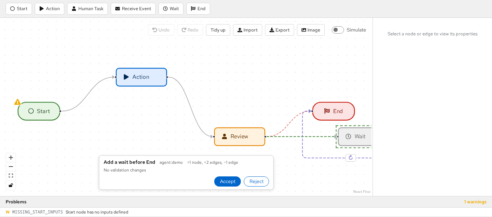
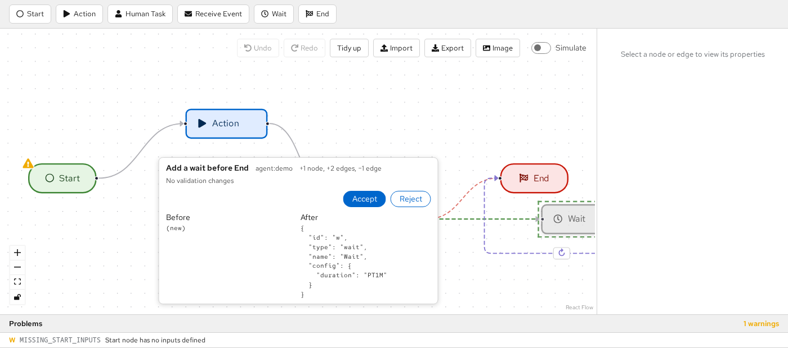
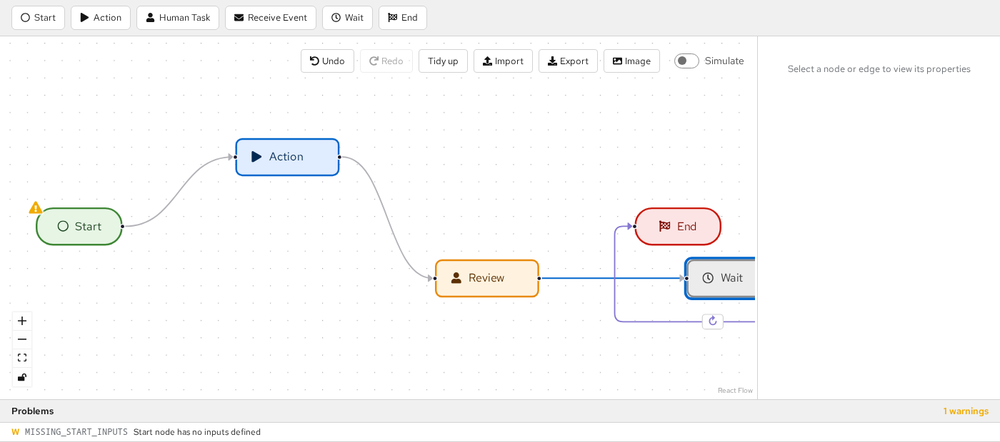
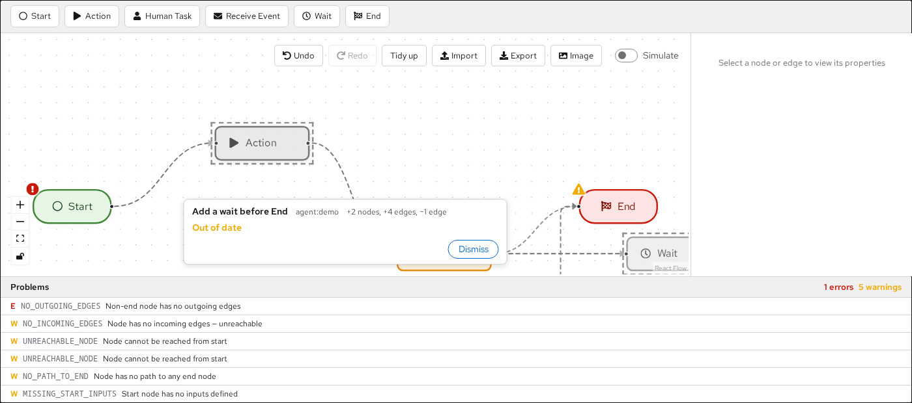
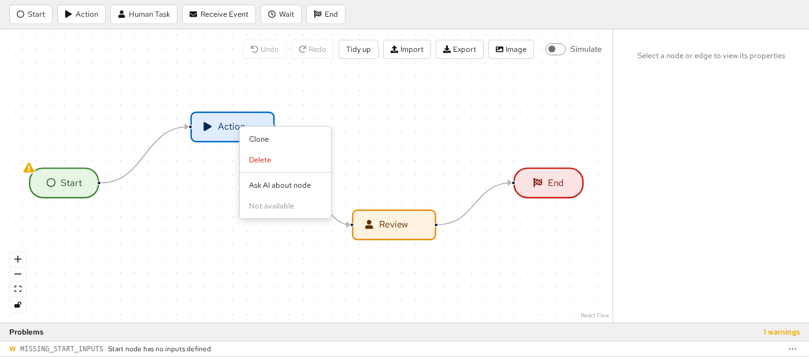
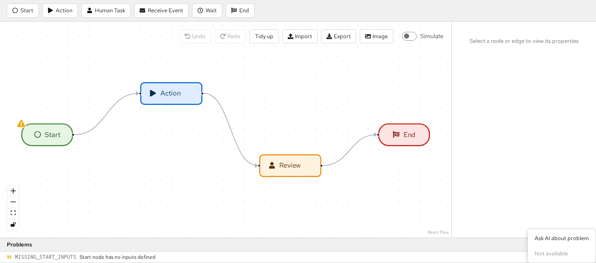
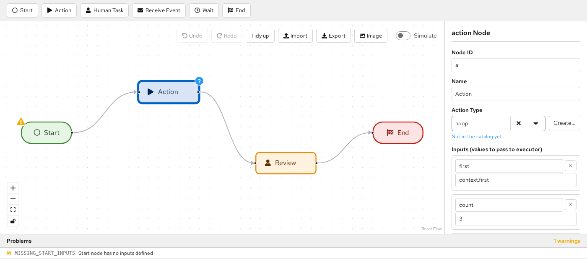

# AI-Assisted Editing

`WorkflowEditor` can be driven by an AI agent while the user keeps editing the same workflow. This page
describes the building blocks a host application uses to do that.

## Overview

Flow is AI-agnostic. The agent, the chat UI and any agent status display live in the host (for example
Apitomy Axiom). Flow exposes an edit API whose primitive is the **change set**: a list of operations
computed against a known content revision. The host can either stage a change set for the user to review
(`propose`) or apply it immediately as one undoable step (`apply`).

```ts
const editorRef = useRef<WorkflowEditorHandle>(null);
// ...
<WorkflowEditor ref={editorRef} workflow={seed} onChange={(workflow, meta) => sendToAgent(workflow, meta)} />;
// later, when the agent answers:
const result = editorRef.current!.propose(changeSetFromAgent);
```

## Content revisions

A content revision identifies the *content* of a workflow, ignoring layout:

```text
"sha256:" + hex(SHA-256(JCS(stripLayout(workflow))))
```

- `JCS` is RFC 8785 JSON canonicalization, so key order and number formatting do not matter.
- `stripLayout` removes `position` from every node. Every other field, including the workflow `id`,
  `name`, `description`, `version` and config extension keys, is part of the content.
- Layout-only edits (moving nodes) do not change the revision, and undoing back to identical content
  restores the identical value.

Hosts computing the revision server-side must hash **exactly** the Flow `Workflow` document they send to
the editor, with no host-specific fields added. Otherwise every change set will be rejected as stale.

```ts
import { computeContentRevision } from '@apitomy/flow-ui';

const revision = computeContentRevision(workflow); // "sha256:3f1c..."
```

In Java, use `io.apitomy.flow.changeset.ContentRevision.of(workflow)`, which accepts either a `Workflow`
model or a Jackson `JsonNode`. Both implementations are verified by `conformance/content-revision.json`.

## Change sets

```ts
interface ChangeSet {
    id: string;
    baseRevision: string;            // the contentRevision the agent based this on
    author: `agent:${string}` | 'host';
    summary: string;
    ops: ChangeOp[];
}
```

| Op | Fields | Effect |
| --- | --- | --- |
| `addNode` | `node` | Adds a node. A node without `position` is placed near its connected neighbours. |
| `updateNode` | `id`, `patch: { name?, config? }`, `unset?` | Updates the name and shallow-merges config. |
| `renameNode` | `id`, `newId` | Renames a node and rewrites `source`/`target` of attached edges. |
| `removeNode` | `id` | Removes a node and every edge attached to it. |
| `addEdge` | `edge` | Adds an edge; both endpoints must exist. |
| `updateEdge` | `id`, `patch`, `unset?` | Shallow-merges edge fields (any field except `id`). |
| `removeEdge` | `id` | Removes an edge. |
| `metadata` | `patch: { name?, description?, version? }` | Updates workflow metadata. |

Ops apply in order and later ops see the effects of earlier ones. Application is atomic: any error leaves
the workflow unchanged.

### Patch semantics

- `updateNode.patch.config` is merged **shallowly** into the existing config. Nested values such as the
  `inputs` and `outputs` mappings are replaced whole.
- `unset` lists top-level config keys (for `updateNode`) or edge fields (for `updateEdge`) to remove, for
  example `timeout` or `condition`. It is applied after `patch`; a key in both is `malformed`.
- `null` in a patch is stored as a value. It does not remove the key; use `unset` for that.

Removing one entry from a nested mapping means resending the whole mapping. To drop input `foo` from an
action node whose inputs are `foo` and `bar`:

```ts
const dropFoo: ChangeSet = {
    id: 'cs-42', author: 'agent:assistant', summary: 'Stop passing foo to the action',
    baseRevision: editorRef.current!.getSnapshot().contentRevision,
    ops: [{ op: 'updateNode', id: 'notify', patch: { config: { inputs: { bar: 'context.bar' } } } }],
};
// unset: ['inputs'] would remove *all* inputs instead.
```

### Errors

Failures are returned, never thrown, as `{ code, opIndex?, reason }`. `reason` is human-readable; `code`
is stable and suitable for mapping to agent prompt hints.

| Code | Meaning |
| --- | --- |
| `target-missing` | The op references a node or edge that does not exist. |
| `duplicate-id` | An added or renamed element's id already exists. |
| `edge-endpoint-missing` | An edge's `source` or `target` does not exist. |
| `malformed` | The op is structurally invalid, for example a key in both `patch` and `unset`. |
| `read-only` | The editor is read-only (editor handle only). |
| `stale` | `baseRevision` does not match the current content revision. Has no `opIndex`. |

The pure functions are exported for use outside the editor:

```ts
import { applyChangeSet, applyChangeSetChecked } from '@apitomy/flow-ui';

const result = applyChangeSetChecked(workflow, changeSet); // also checks baseRevision
if (!result.ok) console.warn(result.error.code, result.error.opIndex, result.error.reason);
```

In Java, `io.apitomy.flow.changeset.ChangeSets.apply(workflow, changeSet)` and
`ChangeSets.applyChecked(workflow, changeSet)` take Jackson `JsonNode`s and return a sealed
`ChangeSetResult` (`Applied(workflow)` or `Rejected(error)`) with the same semantics and error codes. Both
implementations are verified by `conformance/changesets.json`. Java does not place positionless nodes.

## The editor handle

Pass a `ref` to `WorkflowEditor` to obtain a `WorkflowEditorHandle`. None of its methods throw.
Inputs must be structured-cloneable plain JSON data; a change set that cannot be cloned is rejected as
`malformed`.

| Method | Result |
| --- | --- |
| `propose(cs)` | `{ status: 'staged' }` or `{ status: 'rejected', error }`. On a read-only editor it returns `'staged'` but shows no review bar. |
| `apply(cs)` | `{ status: 'applied' }` or `{ status: 'rejected', error }` |
| `withdraw(id)` | Removes the staged proposal if its id matches. |
| `replace(workflow, origin?)` | Replaces the whole document as one undo step. `origin` defaults to `'host'`. |
| `clearHighlights()` | Removes the applied-change highlight. |
| `getSnapshot()` | `{ workflow, contentRevision, selection, problems }` (a detached copy). |

`apply` produces exactly one undo step tagged with `origin = cs.author`. The `workflow` prop remains
seed-only; use `replace` to push a new document from the host.

```ts
const handle = editorRef.current!;
const { contentRevision } = handle.getSnapshot();
const result = handle.apply({ ...changeSet, baseRevision: contentRevision });
if (result.status === 'rejected' && result.error.code === 'stale') askAgentToRetry();
```

## Review UX

- **One proposal at a time.** A new `propose` replaces the staged proposal; the old one resolves as
  `'withdrawn'`.
- **Preview.** The canvas shows the proposal on top of the current document: added elements as dashed
  ghosts, modified and removed elements marked. The canvas stays editable, but proposal elements cannot
  be edited. Clicking a changed element shows a read-only before/after view in the review bar.
- **Review bar.** A floating "Proposed changes" panel at the bottom of the canvas shows the summary, author,
  change counts and a validation delta ("introduces N / fixes M", using built-in validation plus
  `spi.validate`). **Accept** runs the same path as `apply`; **Reject** discards the proposal.
- **Staleness.** Any content edit makes the staged proposal stale, including undo and redo. Layout-only
  edits do not. A stale proposal shows "Out of date" and can only be **Dismiss**ed.
- **Applied highlight.** Elements added or modified by the most recently applied change set (via `apply`
  or Accept) stay highlighted until the next user content edit, `clearHighlights()`, or the next applied
  change set. Disable it with `highlightApplied={false}`.

```tsx
<WorkflowEditor ref={editorRef} workflow={seed} highlightApplied={false} />
```

A staged proposal that adds a Wait node before End: the new node and edges are dashed ghosts, and the
removed edge is drawn dashed in red.



Clicking a changed element shows its before/after in the review bar:



After Accept, the change is one undo step and the changed elements stay highlighted:



A user content edit makes the proposal stale. Only Dismiss remains, and the overlay is greyed out:



## Context actions

Context menus are the place to start AI work from the canvas. `spi.contextActions` is called each time a
menu opens. It receives a `FlowContext` and returns the host items, which are shown below the built-in
Clone/Delete items. Flow never shows a prompt itself: open your own UI from `onSelect`, anchored at
`screenPosition`.

| Surface | Opened by | Target |
|---|---|---|
| Canvas background | Right-click | `{ kind: 'canvas', flowPosition }` |
| Node | Right-click; ContextMenu key or Shift+F10 when focused | `{ kind: 'node', nodeId }` |
| Edge | Right-click; ContextMenu key or Shift+F10 when focused | `{ kind: 'edge', edgeId }` |
| Inside a multi-selection | Right-click on a selected element | `{ kind: 'selection', nodeIds, edgeIds }` |
| Problems panel row | Right-click; the row's "⋯" button | `{ kind: 'problem', problem }` |

```tsx
const spi: EditorSpi = {
  contextActions: (context) => [
    {
      id: 'ask-ai',
      label: context.target.kind === 'problem' ? 'Ask AI to fix this' : 'Ask AI…',
      onSelect: (chosen) => openPrompt({
        anchor: chosen.screenPosition,
        // Use the revision the user was looking at as the change set's base.
        onSubmit: async (text) => editorRef.current?.propose(
          await agent.proposeChange({ text, context: chosen, baseRevision: chosen.contentRevision })),
      }),
    },
  ],
};
```

- **Read-only editors:** built-in items are hidden but host items are shown. Check `context.readOnly` to
  hide your own items as well.
- **Interactivity lock:** when the canvas interactivity lock is on, built-in items are hidden and host items
  are still shown.
- **Simulation:** no menus open while simulating.
- **Problems "⋯" button:** disabled while simulating, and when `contextActions` returns no items for that
  row.
- **Nothing to show:** if neither Flow nor the host has an item, no menu opens.
- **Fresh items:** `contextActions` runs on every opening, so items can depend on the current state, for
  example to hide AI actions while an agent is busy. It is also called, with errors silenced, to decide
  whether a Problems row's "⋯" button is enabled.
- **Errors:** if `contextActions` throws or returns something invalid, Flow logs it and still shows the
  built-in items. If an `onSelect` throws, the error is logged and the menu closes.





## Live Action Type catalog

The editor loads `spi.actionTypes` once for the whole editor. To change the catalog, for example after an
agent creates an Action Type, pass a new array or provider function. The editor reloads it without a
remount, and while a provider function loads it keeps the previous list visible. A catalog that loaded empty
shows a free-form Action Type field and marks every referenced Action Type as unresolved.

```tsx
const [catalog, setCatalog] = useState<ActionTypeDescriptor[]>(initialCatalog);
const spi = useMemo<EditorSpi>(() => ({
  actionTypes: catalog,
  openActionType: ({ value, resolved }) => (resolved ? openEditor(value) : openCreateDialog(value)),
}), [catalog]);
// Later, when Axiom reports a new Action Type:
setCatalog(previous => [...previous, created]);
```

- **Unresolved references:** once the catalog has loaded, an action node whose Action Type is not in it shows
  a "?" marker, and the Properties panel says "Not in the catalog yet". Both disappear as soon as the catalog
  includes the value. Built-in validation does not report unknown Action Types; use `spi.validate` if you
  want a problem.
- **Opening your editor:** when `openActionType` is provided, the Properties panel shows **Open** (or
  **Create…** for an unresolved value) next to the Action Type field. This also applies in read-only
  editors. To offer the same from the canvas, add a host item with `contextActions`.



## Events

- `onChange(workflow, { contentRevision, origin })` — `origin` is `'user'`, `'host'` or `agent:<name>`.
  Accepting a proposal fires `onChange` once, with the agent origin.
- `onProposalResolved(id, outcome)` — `outcome` is `'accepted'`, `'rejected'`, `'stale'` or `'withdrawn'`.
  `'stale'` fires at the moment of invalidation.
- `onSelectionChange({ nodeIds, edgeIds })` — fires only when the selection actually changes; useful for
  opening related host tabs or giving the agent "user is looking at X" context.

```tsx
<WorkflowEditor ref={editorRef} workflow={seed}
    onChange={(workflow, { contentRevision, origin }) => save(workflow, contentRevision, origin)}
    onProposalResolved={(id, outcome) => agent.notify(id, outcome)}
    onSelectionChange={({ nodeIds, edgeIds }) => agent.setFocus(nodeIds, edgeIds)} />
```

## Read-only behaviour

In a read-only editor, `propose` renders the preview without the review bar, which is useful for displaying
a diff. `apply` is refused with the code `read-only`.

```ts
const result = readOnlyRef.current!.apply(changeSet);
// { status: 'rejected', error: { code: 'read-only', reason: '...' } }
```

## Limitations

- **Placement of added nodes.** Added nodes without a position are placed next to their neighbours
  without moving existing nodes. This can produce edges that look like loop-backs; use **Tidy up** to
  re-layout.
- **Stale overlays.** A stale proposal's overlay is diffed against the current document, so while it is
  shown greyed out the user's own later edits also appear as changes.
- **Snapshot problems.** The `problems` in `getSnapshot()` may lag by one render after a handle dispatch
  (`propose`, `apply`, `replace`).
